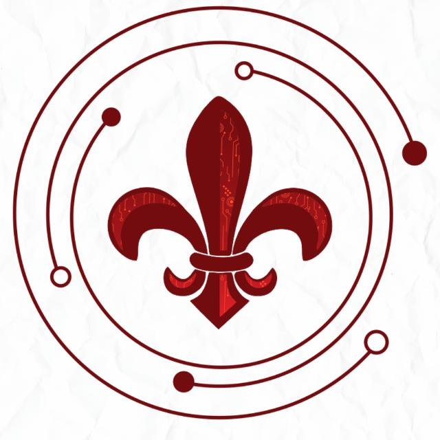

# Bonfimtech

Bem-vindo ao repositório oficial da **Bonfimtech**, a organização escolar dedicada a promover o uso de soluções tecnológicas na educação e fornecer uma plataforma para aprendizado de programação e modelagem 3D.

## Sobre a Bonfimtech

A Bonfimtech é uma iniciativa escolar que visa integrar a tecnologia ao ambiente educacional, desenvolvendo projetos inovadores que beneficiem a escola. Nossa missão é capacitar alunos e educadores com habilidades digitais essenciais, ao mesmo tempo que solucionamos desafios reais por meio da tecnologia.

## Projetos

Neste repositório, você encontrará uma coleção de projetos desenvolvidos pela Bonfimtech, que são voltados para melhorar o ambiente escolar, seja por meio de sistemas de gerenciamento, automação de tarefas, ou outras inovações que tornem a vida escolar mais eficiente e conectada.

## Licença

Todos os projetos deste repositório estão licenciados sob a [MIT License](LICENSE), o que significa que você pode usar, modificar e distribuir o código livremente, desde que mantenha os créditos.

## Contato

Se você tiver dúvidas ou sugestões, sinta-se à vontade para abrir uma [issue](https://github.com/Pedrzi/bonfimtech/issues) ou entrar em contato com a gente por e-mail em [bftbonfim@gmail.com](mailto:bftbonfim@gmail.com).

---

Agradecemos seu interesse em nossos projetos e sua contribuição para tornar a Bonfimtech uma referência em inovação e educação tecnológica!

